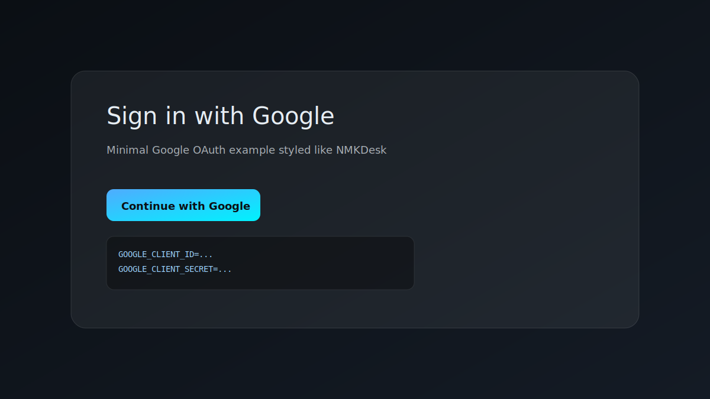

# GoogleLoginWeb

A tiny, clean Flask app that does **Google OAuth login**, styled like the NMKDesk console. Use it as a quick starter for any new project.



## Quick start

```bash
python3 -m venv .venv
source .venv/bin/activate
pip install -r requirements.txt
cp .env.example .env
```

Fill `.env` and run:

```bash
python app.py
```

Open `http://localhost:5000` and click **Continue with Google**.

## How to create `GOOGLE_CLIENT_ID` / `GOOGLE_CLIENT_SECRET`

1. Go to **Google Cloud Console**: https://console.cloud.google.com
2. Create a **new project** (or choose an existing one).
3. In the left menu, go to **APIs & Services → OAuth consent screen**.
   - Choose **External** (for most cases)
   - Fill in app name + support email
   - Save
4. Go to **APIs & Services → Credentials**.
5. Click **Create Credentials → OAuth client ID**.
6. Choose **Web application**.
7. Add this to **Authorized redirect URIs**:
   - `http://localhost:5000/auth/google/callback`
8. Click **Create** and copy your **Client ID** + **Client Secret**.

Put them into `.env`:
```
GOOGLE_CLIENT_ID=...
GOOGLE_CLIENT_SECRET=...
GOOGLE_OAUTH_REDIRECT_URL=http://localhost:5000/auth/google/callback
```

## Notes

- This repo uses `AUTHLIB_INSECURE_TRANSPORT=1` so HTTP works in dev.
- For production, use HTTPS and remove that setting.
